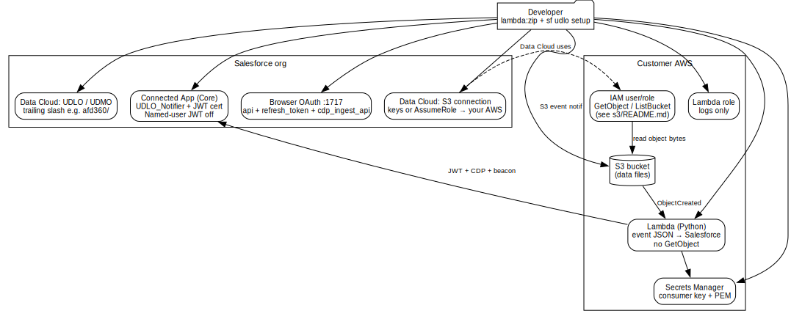

# udlo-notifier

A small **Node CLI** (oclif) that automates setup of an **S3 → Salesforce Data Cloud** unstructured file pipeline (UDLO path): Connected App + JWT, validation of an **existing** Data Cloud S3 connection and UDLO (created by you in the UI), AWS Lambda, Secrets Manager, and S3 event notifications.

**Distribution:** install as an **npm package** and run **`udlo-notifier udlo …`** (recommended for reuse in other repos). You can optionally **`sf plugins link .`** in a clone so the same commands appear as **`sf udlo …`**. **UDLO and S3 connection are not created by this tool** — configure them in Data Cloud first. Salesforce org auth uses the same keys as `sf` (`@salesforce/core`). See `PLAN.md` Phase 5 for design notes.

## Architecture

High-level flow: **your AWS account** holds the data bucket and Lambda; **Salesforce Data Cloud** reads object bytes using **separate** IAM credentials configured on the S3 connection. The Lambda only receives **S3 event metadata** and notifies Data Cloud over HTTPS; it does **not** call `s3:GetObject`.

The diagram is a **[Graphviz](https://graphviz.org/) DOT** file — **no Node/npm dependency**; you only install the Graphviz CLI if you want to render an image.

| | |
|--|--|
| **Source** | [`docs/architecture.dot`](docs/architecture.dot) |
| **How to render SVG** | `cd docs && dot -Tsvg architecture.dot -o architecture.svg` |
| **Install `dot`** | macOS: `brew install graphviz` · Ubuntu/Debian: `sudo apt install graphviz` — see [`docs/README.md`](docs/README.md) |
| **Rendered** | [`docs/architecture.svg`](docs/architecture.svg) (regenerate after editing the `.dot` file) |



**Legend**

| Component | Role |
|-----------|------|
| **Connected App** | Identifies the integration; JWT uses consumer key (`iss`) + integration user (`sub`) + private key from Secrets Manager. |
| **Browser OAuth** | One-time (or after revoke) user consent so Core JWT access tokens can include **Data Cloud ingest** scope; JWT bearer token POST does **not** accept a `scope` query/body parameter on many orgs (`invalid_request: scope parameter not supported`). |
| **Data Cloud S3 connection** | Credentials or role that let **Salesforce** read your bucket; unrelated to the Lambda execution role. **Create the connection in the Data Cloud UI** before **`udlo-notifier udlo setup`**. |
| **UDLO directory** | Must align with object key prefixes and with the directory you set on the UDLO in the UI. S3 event prefixes use the same path shape (the CLI normalizes with a **trailing slash** for notifications, e.g. `afd360/` when you pass `-d afd360`). |
| **Lambda** | Assumes execution role, reads secrets, calls Salesforce OAuth + Data Cloud ingest API, posts the **raw S3 event** (not object body). |
| **IAM for Data Cloud** | Apply via `npm run s3:user-policy` / `s3:role` — see `s3/README.md` and [Data Cloud S3 prerequisites](https://developer.salesforce.com/docs/data/data-cloud-int/guide/c360-a-awss3-prerequisites.html). |

## Prerequisites

| Requirement | Notes |
|-------------|--------|
| **Node.js** | `>= 20` (see `package.json` `engines`) |
| **Salesforce CLI** | `sf` with a logged-in org (`sf org login web` or similar) |
| **AWS credentials** | Environment variables, shared credentials file, or `AWS_PROFILE` — whatever the AWS SDK v3 picks up |
| **OpenSSL** | Used locally to mint the X.509 cert for the Connected App (`openssl` on `PATH`) |
| **Lambda ZIP** | **Default:** stock **`s3/aws_lambda_function.zip`** bundled with the npm package. Pass **`--lambda-zip` / `-z`** only when you want a **custom** build (see below). |
| **Data Cloud → S3** | An **Amazon S3** connection must **already exist** in the org for your bucket (Data Cloud UI). Attach **customer-side IAM** first using **`s3/`** — **`npm run s3:user-policy -- --user <iam-user> --bucket <bucket>`** (note the **`--`** before flags) or **`npm run s3:role -- …`** — see `s3/README.md`. |
| **Data Cloud UDLO** | **Create in the UI** (Data Lake Objects → New → From External Files) with the same API name you pass to **`udlo-notifier udlo setup -n`**. The CLI only **verifies** the object exists via the Connect API. |
| **OAuth consent** | After setup deploys the Connected App, complete the browser step and **Allow** scopes including **Manage Data Cloud Ingestion API data**. Confirm under **Setup → Connected Apps OAuth Usage**. Matches [Set up unstructured data from Amazon S3](https://developer.salesforce.com/docs/data/data-cloud-int/guide/c360-a-awss3-udlo.html). |

## Install and run

From a clone (development):

```bash
git clone <repository-url> udlo-notifier
cd udlo-notifier
npm install
npm run build
npx udlo-notifier udlo --help
```

**Optional — `sf udlo` topic:** from the same directory, `sf plugins link .` then use `sf udlo setup` etc. instead of `udlo-notifier udlo setup`.

## Use in another Salesforce / DX project

Pin the tool as a **devDependency** and call the bin from **npm scripts** (run commands from the project root so **`.udlo-state.json`** lands next to your app):

```json
{
  "devDependencies": {
    "udlo-notifier": "file:../udlo-notifier"
  },
  "scripts": {
    "udlo:help": "udlo-notifier udlo --help",
    "udlo:setup": "udlo-notifier udlo setup -o myOrg -b my-bucket -n MyUdlo"
  }
}
```

Omit **`-z`** to use the **bundled** stock zip from the package. Pass **`-z path/to.zip`** for a **custom** package: e.g. **`npm run lambda:zip --prefix node_modules/udlo-notifier`** (writes **`node_modules/udlo-notifier/dist/lambda-local.zip`**) or the official artifact from [file-notifier-for-blob-store](https://github.com/forcedotcom/file-notifier-for-blob-store). After **`npm install`**, the **`udlo-notifier`** binary is on `PATH` inside npm scripts.

Published installs (`npm install udlo-notifier`) ship **`force-app/`**, **`s3/`** helpers, and **`dist/`** via the package `files` list — no `sf plugins link` required.

## Commands

| Command | Purpose |
|---------|---------|
| `udlo-notifier udlo setup` | Full pipeline: keys → Connected App (+ optional OAuth confirm) → **verify** S3 connection + UDLO exist → AWS (STS, IAM, Secrets, Lambda from **bundled or `--lambda-zip`**) → S3 notifications. Writes **`.udlo-state.json`** in the **current working directory**. |
| `udlo-notifier udlo teardown` | Removes S3 notifications, Lambda, secrets, IAM role; clears state. Does **not** delete the Connected App or the **UDLO** in Data Cloud (remove those in the UI if needed). |
| `udlo-notifier udlo status` | Reads `.udlo-state.json` and probes Salesforce + AWS resources. |

If you linked the plugin: same subcommands as **`sf udlo setup`**, **`sf udlo status`**, **`sf udlo teardown`**.

Examples:

```bash
udlo-notifier udlo setup -o myOrg -b my-bucket -d path/to/files -n MyDocuments
npm run lambda:zip && udlo-notifier udlo setup -o myOrg -b my-bucket -n MyDocuments -z dist/lambda-local.zip
udlo-notifier udlo status -o myOrg
udlo-notifier udlo teardown -o myOrg --auto-approve
```

Useful flags (see **`udlo-notifier udlo setup --help`**):

| Flag | Notes |
|------|--------|
| **`--lambda-zip` / `-z`** | **Optional.** Custom Lambda `.zip` (absolute or relative to **cwd**). If omitted, setup uses the **stock zip** shipped with the package (`s3/aws_lambda_function.zip` next to the installed CLI). |
| `--directory` / `-d` | S3 key prefix without leading/trailing slashes; **empty** = bucket root. Must match your UDLO’s directory in Data Cloud; notifications use a trailing slash when non-empty. |
| `--jwt-audience` | Optional. `https://login.salesforce.com` or `https://test.salesforce.com` for JWT — defaults from the target org. |
| `--oauth-scope` | Optional. Space-separated scopes for the browser `/authorize` step. Default: `api refresh_token cdp_ingest_api`. |
| `--aws-profile` | Optional. AWS named profile (`~/.aws/credentials`). Saved in `.udlo-state.json` on setup; status/teardown use the flag or saved value. |
| `--refresh-connected-app` | Redeploy Connected App metadata (cert, policies). Use after template or org policy changes. |
| `--auto-approve` | Skips the OAuth browser confirmation prompt (still recommended to complete consent once). |

Required: **`--bucket`**, **`--object-name`** (existing UDLO API name). **`--lambda-zip` / `-z`** is optional (bundled default).

## End-to-end preflight (Salesforce + keys + Connected App + Data 360 probe)

```bash
npm run test:e2e
# optional: target org alias
npm run test:e2e -- myOrgAlias
```

| Variable | Purpose |
|----------|---------|
| `UDLO_E2E_SKIP_DATA360` | Set to `1` to skip the Data 360 `connections.list` check |
| `UDLO_E2E_FORCE_DEPLOY` | Set to `1` to redeploy the Connected App even if it already exists |

## Data Cloud S3 (IAM before `udlo-notifier udlo setup`)

Data Cloud needs **GetObject** / **ListBucket** (and related) on your bucket using credentials **you** attach to the S3 connection. That is **not** the Lambda role (which has no S3 access).

```bash
npm run s3:spinup -- help
npm run s3:user-policy -- --user my-iam-user --bucket my-s3-bucket
```

npm treats leading `-` / `--` as its own options unless you insert **`--`** before your script flags. See `s3/README.md`.

## AWS Lambda deployment package

**Default:** setup uploads the **bundled** **`s3/aws_lambda_function.zip`** from the npm package (same artifact family as [file-notifier-for-blob-store](https://github.com/forcedotcom/file-notifier-for-blob-store)).

**Custom zip:** pass **`-z`** with a local `.zip` — for example build from this repo’s **`aws_lambda_function/`**:

```bash
npm run lambda:zip
npm run build && udlo-notifier udlo setup … -z dist/lambda-local.zip
```

| Item | Value |
|------|--------|
| **`--lambda-zip` / `-z`** | **Optional** — overrides the bundled stock Lambda `.zip`. |
| **Runtime** | **Python 3.11** |
| **Handler** | `unstructured_data.s3_events_handler` (must match the ZIP layout) |

If Lambda creation fails with handler or runtime errors, compare with the [file-notifier-for-blob-store](https://github.com/forcedotcom/file-notifier-for-blob-store) AWS function sources.

## Environment variables

Setup prefers **flags** (`--jwt-audience`, `--oauth-scope`, optional **`--lambda-zip`**) over env for the same knobs where applicable. One value is still only read from the environment because it is a **secret**:

| Variable | Used by |
|----------|---------|
| **`SF_UDLO_CLIENT_SECRET`** | Optional Connected App consumer secret for OAuth **authorization_code → token** exchange after browser consent (`src/salesforce/oauth.ts`). Prefer not passing secrets on the command line. |

## Operational notes

1. **S3 object keys** must sit under the prefix you pass as **`--directory`**, and the **Data Cloud S3 connection** root must line up with how you configured folders in the UI (see the [UDLO S3 guide](https://developer.salesforce.com/docs/data/data-cloud-int/guide/c360-a-awss3-udlo.html) path alignment section).
2. **`accepted: true`** on the ingest beacon means the notification was accepted; file processing in Data Cloud can lag. If nothing appears, verify **IAM on the S3 connection principal**, **file type**, and **UDLO directory** vs keys.
3. **Lambda logs** (`udlo-debug` prefix in the packaged handler) help trace Core token **`scope`**, CDP errors, and OAuth failures.

## Project layout (high level)

```
src/
  auth/sf-auth.ts           # resolveConnection() — lazy @salesforce/core
  aws/                      # STS, IAM role, Secrets Manager, Lambda (bundled or custom zip), S3 notifications
  data-cloud/               # Data360Client factory, S3 connection lookup
  salesforce/               # RSA keys, Connected App deploy/retrieve, OAuth callback on :1717
  state.ts                  # .udlo-state.json
  commands/udlo/            # oclif entrypoints (setup / teardown / status)
aws_lambda_function/        # Python Lambda source packaged by npm run lambda:zip
force-app/.../connectedApps/  # UDLO_Notifier Connected App metadata template
s3/                         # IAM policy/role helpers for Data Cloud bucket access
docs/                       # architecture.dot (+ optional generated architecture.svg)
```

## Scripts

| Script | Description |
|--------|-------------|
| `npm run build` | Compile TypeScript to `dist/` |
| `prepack` | Runs **`npm run build`** before **`npm pack`** / publish so the tarball always includes fresh `dist/`. |
| `npm run lint` | `tsc --noEmit` (typecheck tests + `src`) |
| `npm test` | Vitest |
| `npm run test:e2e` | Build + Salesforce / keys / Connected App / Data 360 smoke script |
| `npm run lambda:zip` | Package `aws_lambda_function/` into `dist/lambda-local.zip` (requires `zip` CLI) |
| `npm run s3:spinup` | Shell entry to `s3/spinup.sh` |

## State file

Successful runs write **`.udlo-state.json`** in the working directory (resource IDs for teardown). This repo ignores it in `.gitignore`.

## References

- Architecture diagram (Graphviz): [`docs/architecture.dot`](docs/architecture.dot)
- Implementation plan: `PLAN.md`
- Data Cloud S3 IAM helpers: `s3/README.md`
- Reference Lambda / ZIP: [forcedotcom/file-notifier-for-blob-store](https://github.com/forcedotcom/file-notifier-for-blob-store)
- Data Cloud API: [data-360-sdk](https://www.npmjs.com/package/data-360-sdk)
- UDLO from Amazon S3: [Salesforce Developers — Set up unstructured data from Amazon S3](https://developer.salesforce.com/docs/data/data-cloud-int/guide/c360-a-awss3-udlo.html)
